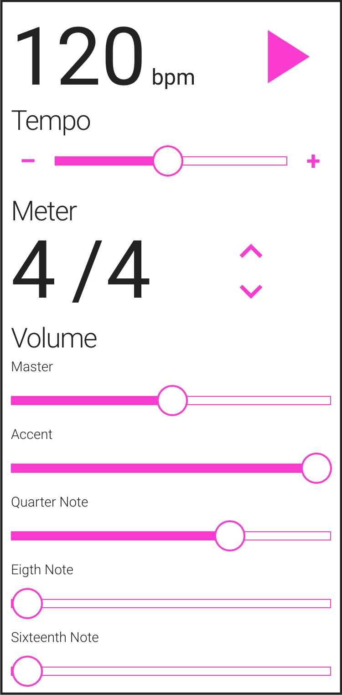

# metronome-app


A mobile friendly metronome web app built using the Web Audio API, Web Workers, React, and Redux. This is a work in progress, and something I'm developing in my free time. 
Checkout the open issues if you'd like to contribute!

## Motivation
I started developing this app so that I could have a web based metronome with a simple UI and a friendly mobile UX while practicing drums. 
I didn't want to download another metronome app to my phone (my previous one stopped getting updated and was no longer supported on iOS) 
and I couldn't seem to find a free one on the web that I liked.
Google provides a working web based metronome at the top of its search results, but its fairly limited in terms of interaction.
I wanted something that was easy to adjust the meter, tempo, volume, and beat sub-divisions
similar to a digital metronome or drum machine such as the [Dr. Beat](https://www.boss.info/us/products/db-90/) I used to practice with as a kid.

## Install
Requires Node.js, npm, and optionally Yarn for managing dependecies, compiling source code, and running tests.

In a terminal, `cd` to this repo and do:

```
npm install
```

or with `yarn`:

```
yarn
```
Note that any of the scripts mentioned here out can be run using `yarn` instead of `npm`.

## Develop
To have Webpack bundle the files and start a local dev server:

```
npm start
```

To run the tests using `jest` do:

```
npm test
```

or

```
npm test:watch
```

To lint the code using `eslint` do:

```
npm eslint-check
```

## Build
To have Webpack create a production optimized build:

```
npm run build
```

## Deploy
To deploy the app to Github Pages:

```
npm run deploy:gh-pages
```

## Resources
Some links to articles and documentation relating to the Web Audio API.

https://developer.mozilla.org/en-US/Apps/Fundamentals/Audio_and_video_delivery/Web_Audio_API_cross_browser

https://developer.apple.com/library/content/documentation/AudioVideo/Conceptual/Using_HTML5_Audio_Video/PlayingandSynthesizingSounds/PlayingandSynthesizingSounds.html

https://developer.mozilla.org/en-US/docs/Web/API/BaseAudioContext/createOscillator

https://developer.mozilla.org/en-US/docs/Web/API/Web_Audio_API/Using_Web_Audio_API

https://developer.mozilla.org/en-US/docs/Web/API/OscillatorNode

https://gist.github.com/laziel/7aefabe99ee57b16081c

## Credits
Some code borrowed from @scottwhudson's [metronome](https://github.com/cwilso/metronome) which borrowed code from @cwilson's [metronome](https://github.com/cwilso/metronome).